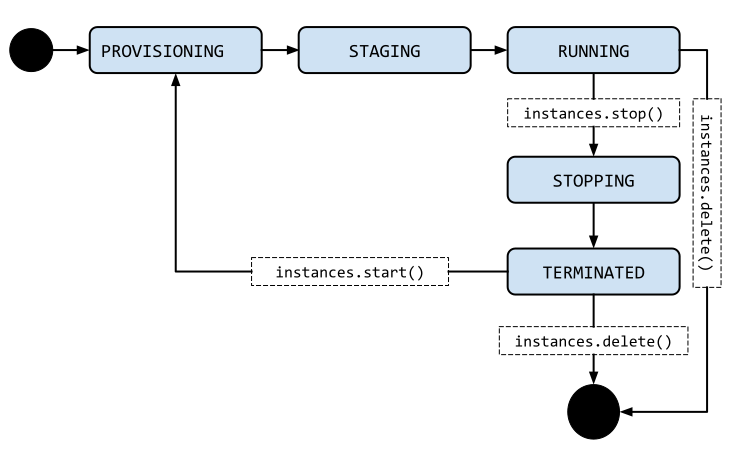
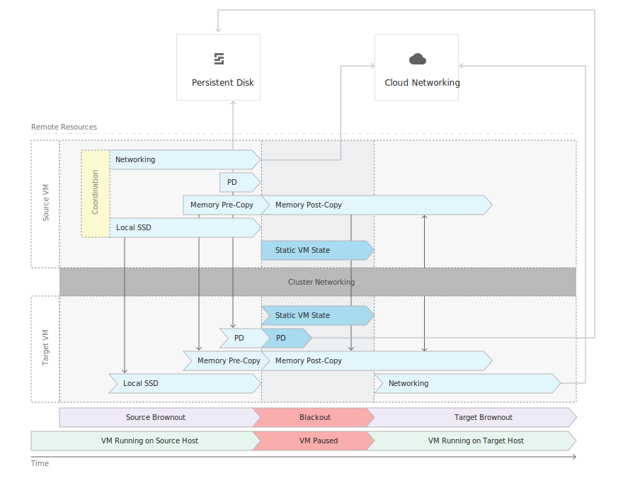
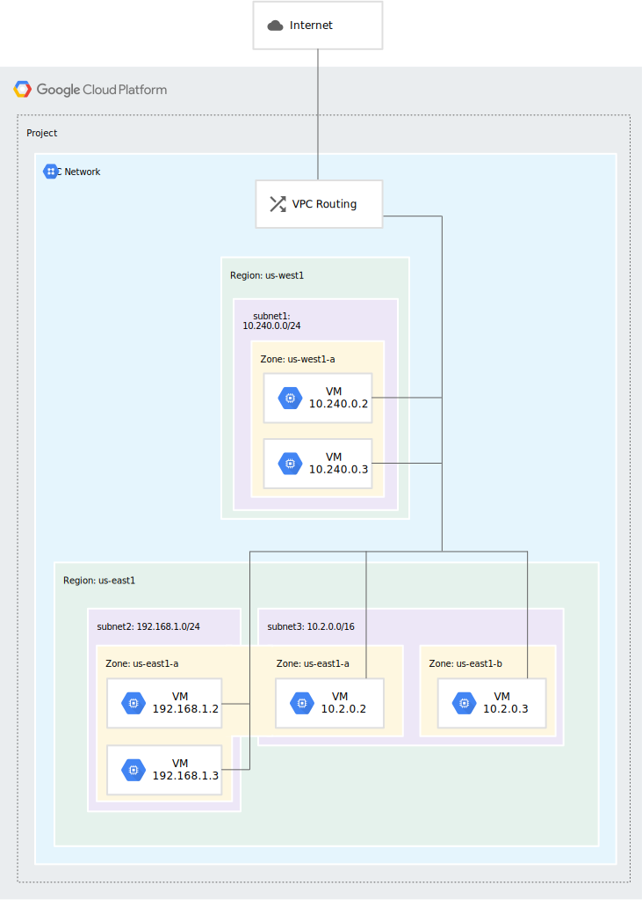
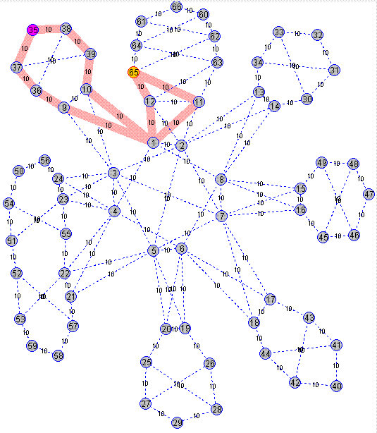
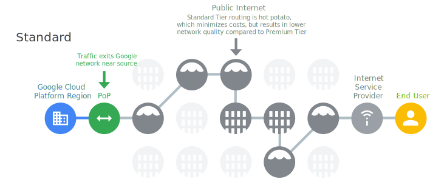
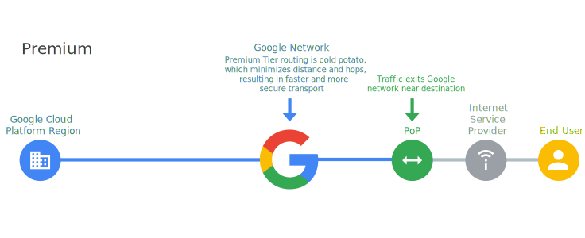
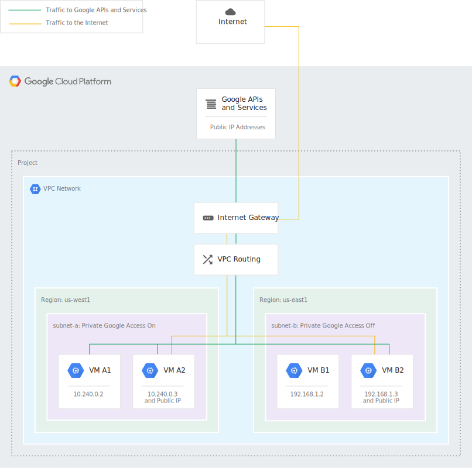
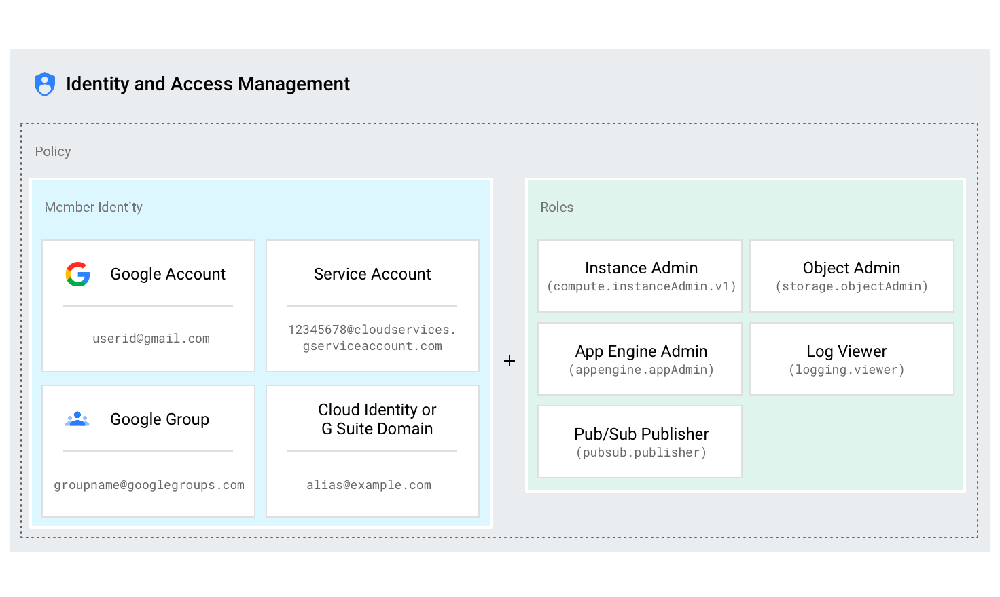
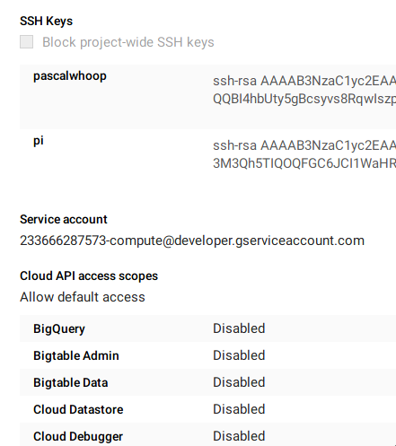
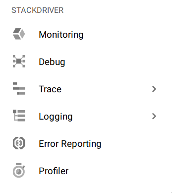

# Notes about studying for the GCP Architect Exam <!-- omit in toc -->

- [Preparation with the top-down approach](#Preparation-with-the-top-down-approach)
  - [Mountkirk Games Case Study](#Mountkirk-Games-Case-Study)
  - [Dress4Win](#Dress4Win)
  - [Business Design](#Business-Design)
  - [Case Study Analysis](#Case-Study-Analysis)
  - [Security and Compliance](#Security-and-Compliance)
- [Costs](#Costs)
- [Services available](#Services-available)
  - [Key Differences to AWS](#Key-Differences-to-AWS)
  - [Compute](#Compute)
    - [App Engine](#App-Engine)
    - [Compute Engine](#Compute-Engine)
      - [Types](#Types)
    - [Cloud Functions](#Cloud-Functions)
  - [Storage options & Databases](#Storage-options--Databases)
    - [Cloud Storage](#Cloud-Storage)
      - [Storage classes](#Storage-classes)
      - [Storage location](#Storage-location)
      - [Object metadata](#Object-metadata)
      - [Access control](#Access-control)
    - [Cloud SQL](#Cloud-SQL)
    - [BigQuery](#BigQuery)
    - [BigTable](#BigTable)
    - [Cloud Spanner](#Cloud-Spanner)
    - [Cloud Memorystore](#Cloud-Memorystore)
    - [Cloud Firestore and Firebase Realtime Database](#Cloud-Firestore-and-Firebase-Realtime-Database)
  - [Networking](#Networking)
    - [Virtual Private Cloud](#Virtual-Private-Cloud)
      - [Shared VPC](#Shared-VPC)
      - [Firewall Rules](#Firewall-Rules)
      - [Routes](#Routes)
    - [Google CDN](#Google-CDN)
    - [Traffic Routing](#Traffic-Routing)
    - [Cloud Router](#Cloud-Router)
    - [Load Balancer](#Load-Balancer)
      - [SSL Proxy Load Balancing](#SSL-Proxy-Load-Balancing)
    - [Private Access Options](#Private-Access-Options)
    - [Connect options](#Connect-options)
      - [VPN](#VPN)
      - [Cloud Interconnect](#Cloud-Interconnect)
      - [Dedicated Interconnect](#Dedicated-Interconnect)
      - [Direct Peering](#Direct-Peering)
      - [Carrier Peering](#Carrier-Peering)
  - [AI and ML](#AI-and-ML)
    - [Cloud AutoML](#Cloud-AutoML)
      - [Video Intelligence](#Video-Intelligence)
      - [AutoML Vision](#AutoML-Vision)
    - [Cloud Vision](#Cloud-Vision)
    - [Cloud Natural Language](#Cloud-Natural-Language)
    - [Cloud Machine Learning Engine](#Cloud-Machine-Learning-Engine)
    - [Text 2 Speech, Translation, Speech 2 Text](#Text-2-Speech-Translation-Speech-2-Text)
    - [Cloud Inference API](#Cloud-Inference-API)
    - [Dialogflow Enterprise](#Dialogflow-Enterprise)
  - [Big Data](#Big-Data)
    - [BigQuery](#BigQuery-1)
    - [Cloud Dataflow](#Cloud-Dataflow)
    - [Cloud Dataproc](#Cloud-Dataproc)
    - [Cloud Datalab](#Cloud-Datalab)
    - [Cloud Dataprep](#Cloud-Dataprep)
    - [Cloud Pub/Sub](#Cloud-PubSub)
    - [Cloud Composer](#Cloud-Composer)
    - [Cloud Data Fusion](#Cloud-Data-Fusion)
    - [Data Catalog](#Data-Catalog)
    - [Genomics](#Genomics)
    - [Google Marketing Platform\*](#Google-Marketing-Platform)
    - [Google Data Studio\*](#Google-Data-Studio)
    - [Firebase Performance Monitoring](#Firebase-Performance-Monitoring)
  - [Security](#Security)
    - [Access Transparency](#Access-Transparency)
    - [Binary Authorization](#Binary-Authorization)
    - [Cloud Audit Logs](#Cloud-Audit-Logs)
    - [Cloud IAM](#Cloud-IAM)
      - [Resources](#Resources)
      - [Permissions](#Permissions)
      - [Roles](#Roles)
      - [Policy](#Policy)
    - [Cloud Identity](#Cloud-Identity)
    - [Identity Platform](#Identity-Platform)
    - [Cloud Identity-Aware Proxy](#Cloud-Identity-Aware-Proxy)
    - [Cloud Data Loss Prevention](#Cloud-Data-Loss-Prevention)
    - [Cloud HSM](#Cloud-HSM)
    - [Cloud Key Management Service](#Cloud-Key-Management-Service)
    - [Cloud Security Command Center](#Cloud-Security-Command-Center)
    - [Cloud Security Scanner](#Cloud-Security-Scanner)
    - [Context-aware access (beta)](#Context-aware-access-beta)
    - [Event Threat Detection (beta)](#Event-Threat-Detection-beta)
    - [Managed Service for Microsoft Active Directory (alpha)](#Managed-Service-for-Microsoft-Active-Directory-alpha)
    - [Policy Intelligence (alpha)](#Policy-Intelligence-alpha)
    - [Resource Manager](#Resource-Manager)
    - [Security key enforcement](#Security-key-enforcement)
    - [Titan Security Key](#Titan-Security-Key)
    - [VPC Service Controls](#VPC-Service-Controls)
    - [Key encryption](#Key-encryption)
  - [Auxillary Services](#Auxillary-Services)
    - [Deployment Manager](#Deployment-Manager)
    - [StackDriver](#StackDriver)
    - [Cloud Services Platform](#Cloud-Services-Platform)
    - [Encryption alternatives](#Encryption-alternatives)
- [Terminology](#Terminology)
- [whizlabs exams](#whizlabs-exams)
  - [Exam 1](#Exam-1)
  - [Exam 2](#Exam-2)
- [Google Cloud Next '19](#Google-Cloud-Next-19)
  - [Anthos](#Anthos)
  - [Traffic Director](#Traffic-Director)
  - [Cloud Run](#Cloud-Run)
  - [Event Thread Detection](#Event-Thread-Detection)
  - [Cloud SQL for SQLServer](#Cloud-SQL-for-SQLServer)
  - [Managed Service for Microsoft Active Directory](#Managed-Service-for-Microsoft-Active-Directory)
- [Experiments](#Experiments)
  - [Building a time tracker to ask "what have you been up to?"](#Building-a-time-tracker-to-ask-%22what-have-you-been-up-to%22)
  - [Building a "track myself and all my stuff" messaging system](#Building-a-%22track-myself-and-all-my-stuff%22-messaging-system)
    - [Template for tasker HTTP POST](#Template-for-tasker-HTTP-POST)
- [Overall notes](#Overall-notes)
  - [Andromeda - Network virtualization](#Andromeda---Network-virtualization)
  - [Instance Metdata Service](#Instance-Metdata-Service)
  - [Quotas and Limits](#Quotas-and-Limits)

[a summary of someone who passed](https://acloud.guru/forums/gcp-certified-associate-cloud-engineer/discussion/-LIOFT9LbRdukVH9AdVk/passed_professional_cloud_arch)
that I read before starting. Good overview of what to focus on.

> How much confidence do you want? I will often dig into the documentation and not only prove to
> myself exactly why the correct answer is correct. But I will also continue studying until I know
> with absolute certainty exactly why each incorrect answer is wrong. I want to be able to state the
> reason it is not correct. Because that is how I know that I have studied enough.

---

## Preparation with the top-down approach

https://www.coursera.org/learn/preparing-cloud-professional-cloud-architect-exam

### Mountkirk Games Case Study

- transactional for state
- timeseries for future analysis
- no lost data due to processing backlogging (bottleneck transaction security)
- hardened linux distro

The sample answer was a lot more focused on the Google Platform services. My idea was to use some DB
service as a game base and some streaming tool like kafka on the analytics side. The answer of their
system was to use BigQuery as the analytics backing and a NoSQL "DataStore" service as a Game
Backing. User data may be placed into a sql service although I am unsure why the user accounts are
sql targeted but the game itself makes sense to be placed into nosql

> LEARN: Know GCP services inventory

### Dress4Win

- web based tool
- manage your inventory of "things" (dresses)
- freemium, ads and tracking
- first migrate dev and test to cloud
- Current setup:
  - 40 web servers with tomcat and static stuff (microservices)
  - 20 apache hadoop/spark servers for analysis
  - 3 RabbitMQ servers for messaging
  - Misc servers (bursty)
  - MySQL 1 Server
  - 3 Redis servers for metadata, social, caching
  - 80% of our capacity is sitting idle

Proposed changes / solutions

- K8S cluster for web / microservices
- CI/CD services hooked into source code

### Business Design

- Cake / Layers of components that are affected by the architecture

1. _Service Definition_: Which services to use
2. _Business Layer_: What technology requirements does the business layer bring?
3. _Data Layer_: What storage technologies are most suitable for the case (graph/sql/document/...)
4. _NW and Presentation Layer_: What network I/O and what client tech will be used
5. _Scalability and Recover_: What is the expected variance of load / throughput and how resilient
   does the system have to be?
6. _Security_: How do you ensure system security
7. _Capacity and Cost_: Storage as well as compute and finanical impact
8. _Deploying and Monitoring_: CD, Monitoring, Operations, Alerting, Updading

The recommended approach is to _divide and iterate_, meaning to first split the architecture
thoughts up in the layers above and consider each layer for the right solution and to then
iteratively reconsider all affected layers when one layer changes due to newly discovered
constraints.

### Case Study Analysis

- looking for standards and systems
- slow innovation and experimentation
- VMs take weeks
- we want quick development abilities for teams
- review process, then deploy envs at scale in minutes

Solution approach: Some sort of request for resources. I.e. a "create project with resource X and Y
and Z. This is all a "template" that needs to be signed off and once it is, it will be instantiated.

### Security and Compliance

- IAM Rules and Groups set up appropriately
  - roles / groups should be used to map access to certain people
  - service accounts with audit trails should be used for high risk activities
  - separate duties that have large impact, requiring several individuals to complete
- VPC / VPN / SSL tunnels
- ISO 27001/27017/27018 and SOC 1/2/3

**Checklist**:

- IAM / user access within the application and outside
- network access / rules
- TODO

## Costs

- Data moving: between zones, regions, continents
- Data performance / storage size
- compute server size / hardware
- different regions
- network and disk I/O
- redundancy
-

## Services available

A short list of simple explanations of each service. An
[exhaustive list](https://cloud.google.com/products/) and a
[high level overview](https://cloud.google.com/docs/overview/cloud-platform-services) is the base of
this list, together with a bunch of SO answers. This
[platform overview](https://cloud.google.com/docs/overview/) is also a good read to get a general
overview of te whole system. As an AWS professional,
[this quick intro](https://cloud.google.com/docs/compare/aws/networking) may give some perspective
in relation to AWS.

### Key Differences to AWS

- networks are global, subnets are regional,
- Load Balancers
  - Layer 7 LBs are global. LB's can be _internal_ or _external_ whereas in AWS, LBs are always of
    one type. GCP Layer 4 LBs only support VM instances as targets
  - DNS A record for LB instead of CNAME record
  - pay per GB instead of pay per hour active
- instance migration is transparently done using
  [live migration](https://cloud.google.com/compute/docs/zones#maintenance)


### Compute

#### App Engine

is a Platform-as-a-Service. It means that you simply deploy your code, and the platform does
everything else for you. For example, if your app becomes very successful, App Engine will
automatically create more instances to handle the increased volume.

- **Standard Environment**: Runs in a _sandbox_, very controlled by Google in terms of versions,
  environment etc. Extremely fast scaling, good for extreme spikes of traffic
- **Flexible Environment**: A mix between Compute Engine and App Engine as it allows env
  manipulation through dockerfiles. Basically a stripped down way of running a container with a
  specific runtime in it.

#### Compute Engine

is an Infrastructure-as-a-Service. You have to create and configure your own virtual machine
instances. It gives you more flexibility and generally costs much less than App Engine. The drawback
is that you have to manage your app and virtual machines yourself.

- Preemptive VMs are used to reduce costs and get instances that may be killed occasionally through
  a cluster operation manager to free compute capacity for other customers. This is ideal for build
  CI/CD workers, machine learning etc.
- VMs belong to a VPC network, they cannot be part of several networks



- Provisioning means "allocation of resources in progress"
- Staging: "preparing instance" (i.e. bootstrapping, copying of data etc)

Instances are migrated in a live-state for several reasons (including maintenance, damages,
upgrades, etc).

 As an example, my micro instance was migrated 3 times in 6 months without
any downtime to it.

##### Types

- You can have MS, Linux or Docker (which run on a container optimized VM image)
- properties (RAM/CPU vCore, storage, ...) can either be picked from predefined VMs or custom
  definitions
- high-level types: -
  - General Purpose
  - Compute
  - Memory
  - Shared-Core

#### Cloud Functions

- enable small units of highly scalable code to be deployed in the cloud
- usually good to be combined with PubSub and storage services like datastore
- a bit tedious to test, especially when interacting a lot with the google API in python
- base64 encoded stuff is a bit misguiding and could be more clearly typed

### Storage options & Databases

- HDD encrypt with AES128, SSDs with AES256 both at storage system and storage device level

#### Cloud Storage

Object storage that combines four levels of classes (geo redundant all the way to coldline.

Storage is always part of project. Buckets are the core containers of data. They need a globally
unique name. Buckets require a geographic location. These can be regional or multi-regional (yet
still usually on the same continent).

Some other key things to note:

- objects can be versioned with the _object versioning feature_
- object overwrites can happen at most once per second

##### Storage classes

- `multi_regional` serving data _outwards_ across the globe
- `regional` frequently accessed data, ideally colocated to the consuming entities (such as
  analytics)
- `nearline` rarely accessed things. Long-tail multimedial content, backups
- `coldline`: archival, disaster recovery, auditing

Storage classes can be set both on bucket and object level. Chosing a regional storage can also
improve performance and reduce networking charges, when creating systems such as a data-lake.

##### Storage location

`regional` vs `multi_regional`. These can be combined with the above _classes_. This means
coldline/nearline can be both regional and multi_regional.

##### Object metadata

- both fixed-keys such as `Content-Type` and `Cache-Control` as well as custom metadata
- served as HTTP headers, therefore shouldn't exceed 16KB

##### Access control

- IAM for bucket level access rules.
- ACLs for fine-grained augmentation of the above Cloud IAM permissions
- Signed URLs for time-limited r/w access
- Signed Policy Documents: Specify size, type and other characteristics
- Firebase Security Rules for firebase driven applications

[For inspiration](https://cloud.google.com/storage/docs/collaboration)

#### Cloud SQL

MySQL and PostgreSQL as a Service

#### BigQuery

- Googles All-In-One data solution for anything that is a source for analytics
- Scales infinitely
- Takes streaming as an input for streams of data coming in
- SQL against datasets, column stores, spreadsheets and object storage

#### BigTable

- NoSQL
- Wide Column
- analytics backing but also requires updates of existing data (contrary to BigQuery / Hadoop)
- similar to Cassandra

#### Cloud Spanner

Georedundant, scalable relational database

#### Cloud Memorystore

- In Memory managed database based on Redis

#### Cloud Firestore and Firebase Realtime Database

- databases intended for mobile applications data to store app data at a massively simplified level.
  The target customer is the mobile developer class and intends to allow easy backend creation for
  JS/Android/iOS developers

### Networking

The key offerings are stated as:

- **Global**: GCP VPC offers a _single global cloud_
- **Shareable**: don't create separate networks and/or accounts for separate billing
- **Expandable**: No downtime on network address redefinitions
- **Transparent**: VPC flow logs allow monitoring for performance analysis and forensics
- GCP has no load balancers just load balancing at the network level. IP anycast based load
  balancing allows for instant balancing instead of
  [dns based load balancing](https://www.nginx.com/resources/glossary/dns-load-balancing/) by
  routing requests always to the nearest serving instance
- internal load balancing allows
- **Choose Performance**: By selecting between the
  [two network pricing tiers](https://cloud.google.com/network-tiers/pricing). Premium outperforms
  AWS/Azure while standard is comparable to other clouds.



#### Virtual Private Cloud

Networks, routes and firewalls are global resources. Subnets are regional resources. Resources
within a VPC communicate via IPv4, subject to firewall rules. Instances with internal IP addresses
can communicate with Google APIs and services. NW administration is secured using IAM rules

Subnets can also span several zones whereas
[in AWS](https://docs.aws.amazon.com/vpc/latest/userguide/VPC_Subnets.html), they are locked to an
AZ. 

Networks can be in `auto` or `custom` mode. Auto mode creates a subnet per region and separates the address spaces appropriately. Custom mode requires you to manually create subnets in the regions. 

##### Shared VPC

To create a shared VPC, an organization needs to define a project as the _host project_ which then
contains all other projects. This host project now represents the entry point of the VPC
configuration, meaning all projects under this host project are part of the VPC. Firewalls, subnets
and routes are _centralized_ while administration of instances, resources and services are
_decentralized_ and delegated to the _service project admins_

##### Firewall Rules

> Every VPC network has two implied firewall rules that block all incoming connections and allow all
> outgoing connections.

> The default network has additional firewall rules, including the default-allow-internal rule,
> which permit communication among instances in the network.

To configure a firewall rule, a set of components needs to be defined to describe the rule:

| Type                          | Example                     | Description                                                                                                                                                 |
| :---------------------------- | :-------------------------- | :---------------------------------------------------------------------------------------------------------------------------------------------------------- |
| numerical priority            | 1-9999                      | lower number == higher priority                                                                                                                             |
| direction of traffic          | `ingress`/`egress`          |                                                                                                                                                             |
| action                        | `allow/deny`                |
| target                        | `192.168.1.0/24`, `sometag` | Subset( [CIDR](https://en.wikipedia.org/wiki/Classless_Inter-Domain_Routing#CIDR_notation) IP string, tags, accounts) :: Instance to which the rule applies |
| source / destination          | _see above_                 | _see above_ :: `source` for ingress :: `destination` for egress                                                                                             |
| protocol                      | `TCP/UDP/ICMP`              |                                                                                                                                                             |
| port                          | `icmp,tcp:80-88`            |
| status (`enabled`/`disabled`) |                             |

> Important: A port cannot be specified by itself. If you only specify a number, GCP interprets that
> as a decimal IP protocol. For example, if you specify 80 by itself, GCP interprets that as IP
> protocol 80 (ISO-IP), which is not the same thing as TCP port 80 (tcp:80).

When a _service account_ is selected as the target for a rule, the account needs to exist before the
rule is created. Once it's created, also new instances launched under this account will adhere to
the rule.

##### Routes

- Describe the path packages take in the networks.
- Default route to `0.0.0.0/0` points to `default-internet-gateway` to ensure internet access
  (together with a permissive egress firewall rule)
- subnet routes are autogenerated, pointing to the subnet's IP range as the destination
- applicability of a route is determined by destination specificity (similar to CSS rule application
  ordering)
- custom static routes are applied to instances using `route tags` and `network tags` on the
  instances
- GCP follows a set of steps to determine the routing of a package
- if a unique route cannot be determined,
  [ECMP](https://en.wikipedia.org/wiki/Equal-cost_multi-path_routing) (Equal cost, multiple paths)
  routing is deployed



#### Google CDN

- Single IP around the globe
- SSL by default, SYN flood defence built in
- HTTP2, QUIC, gRPC

#### Traffic Routing

There are two main routing models:

- hot potato: try to hand off a package ASAP 
- cold potato: keep a package in own network as long as possible 

Hot potato routing uses the standard internet routing logic which probably leads to a lower
performance but adheres to standard internet principles.

Routing can be defined on an project or resource level. Lower level configurations take precedence.

Generally, switching between the two tiers involves deletions of forwarding rules, assignment of new
IP addresses and other changes. Maintenance efforts should be anticipated.

> You cannot use Premium networking as a backup for Standard. If, during an outage for Standard
> networking (e.g., due to a fiber cut), you reclassify your traffic as Premium, it will be treated
> as Standard for the duration of the outage.

#### Cloud Router

- BGP (Border Gateway Protocol) exchange routing and reachability information

#### Load Balancer

Layer 4 LB is based on [maglev](https://ai.google/research/pubs/pub44824), Google's solution for
software based load balancing. It's based on commodity linux machines that are behind a network
router using _equal cost multipath_ to distribute packages to each of the machines.

Layer 7 LB is a global resource. It deploys [_anycast_](https://en.wikipedia.org/wiki/Anycast) to
distribute load based on network intelligence, i.e. the latency from the client. It also allows URL based routing and balances _per request_ instead of _per connection_. It also integrates with Cloud CDN

##### SSL Proxy Load Balancing

- Terminates SSL at the LB then balances connections across backends
- global service, across regions 
- ssl certificates can be google managed

#### Private Access Options

Enterprise regulations often require private access to networks and/or completely walled-off and
_closed off_ networks. Also, when talking about hybrid clouds, these two sides may need to be
connected. Here are four approaches:

1. Private Google Access
   - If an instance has no external IP and it is not configured to have
     [Cloud NAT](https://cloud.google.com/nat/docs) (see
     [internet access requirements](https://cloud.google.com/vpc/docs/vpc#internet_access_reqs)), it
     can still be configured to have _Private Google Access_. This allows the instance to access the
     Google services without having global internet access. To access the services, it still uses
     the public DNS names.
   - This setting is a **subnet level** configuration
   - in the below graphic: VMA1 has access because of PGA ON, VMA2 as well because of public IP +
     PGA ON, VM B1 doesn't, because it's lacking a public IP + PGA OFF



2. Private Google Access for on-premises hosts
   - giving access to instances running on premise which are connected to the VPC via a VPN tunnel
     (using a `Cloud VPN Gateway`)
   - Route/Firewall/DNS setup is required on premise
   - route in VPC to `199.36.153.4/30` next hop `internet gateway` required (points at Google APIs)
     - requires Cloud Router with route configured as above
     - points to `restricted.googleapis.com`
3. Private Services Access
   - basically VPC peering
   - reserve a CIDR block for the partner VPC to avoid overlap
4. Serverless VPC Access
   - access VPC from AppEngine and/or cloud functions
   - based on _connectors_
   - works only in the _ingress_ mode, i.e. only accessing VPC resources. The other direction
     requires _Private Google Access_

#### Connect options

GCP offers several ways of connecting to a VPC from on-site

##### VPN

The simplest of ways to securely connect an on-prem network to a VPC (and its possibly non-public
instances) is through a Cloud VPN. For this, an IPSec tunnel is created that tunnels all
communication between the two networks securely. There are two forms of VPN offered by GCP:

- Classic VPN: 99.9% SLA, connection happens through Cloud VPN Gateway + appropriate routing tables.
  Redundancy and failover can be achieved by opening two tunnels to GCP with two on-site gateways.
  Alternatively, the HA VPN can be chosen
- HA VPN: 99.99% SLA, Chooses 2 public IPs for two gateways. Multiple tunnels per GW are allowed.

Each tunnel supports a _max_ of 3 Gbps. This is largely depending on the configuration such as
_packet size, package rate, network route (direct peer vs internet), RTT and package loss_. Scaling
can be achieved by increasing the number of tunnels, either by adding gateways on prem or in the
cloud (or both). A (sometimes hidden) bottleneck may be hit which is equal to the total capacity of
the sum of all paths in the ECMP subgraph. So if the connections GCP<->on-prem are largely made up
of three paths, the sum of these three paths is a upper bound unless additional direct connections
are set up.

VPNs are not allowed to be used as a hub-spoke architecture, meaning as a means of connecting two
networks with each other through GCP.

> Maintenance for Cloud VPN is a normal, operational task that may happen at any time without prior
> notice. Maintenance periods are designed to be short enough so that the Cloud VPN SLA is not
> impacted.

→ HA VPN to avoid maintenance driven outages.

##### Cloud Interconnect

- A direct connection to GCP from the on-site network through a supported service provider
- no VPN necessary. IPs from the VPC are directly addressable from the on-site network
- up to 200Gbps with 2x 100Gbps connections (or up to 8x 10Gpbs) with dedicated interconnect and max
  80Gbps with partner interconnect
- avoids egress costs as the connection is used instead of public internet traffic (which incurs GPC
  egress costs)

##### Dedicated Interconnect

A physical interconnect with Googles network in
[one of 81 locations](https://cloud.google.com/interconnect/docs/concepts/colocation-facilities).
The interconnect works by connecting an on-prem router to the Google Peering Edge facility with 1 or
2 100G fiber connections.

As an idea, 2x 100G interconnect costs 26k \$ / month

Egress pricing becomes cheaper when using direct interconnect vs normal egress prices. As an example

|                        | DI     | Normal Egress |
| :--------------------- | :----- | :------------ |
| Per GB                 | 0.02   | 0.08          |
| Connection cost 10Gbps | 1700   | 0             |
| TB transfer/month                     | 28.3TB | 28.3TB        |
| total                     | 1700+560 | 2264        |

Therefore, the break-even for a 10GB dedicated interconnect is at about 28TB/month data egress from the VPC

##### Direct Peering

Direct peering is a non-GCP driven technique of connecting two networks to each other. This technique is opaque to GCP and comes at no costs (from Google). Egress traffic comes at a discounted price of 0.05/GB, i.e. 3 cents less than normal egress but 3 cents more than dedicated interconnect. 

##### Carrier Peering

Similar to direct peering but done through a service provider instead of being managed by the company itself. 

### AI and ML

#### Cloud AutoML

- automatically training NN by having a "meta NN" find the best NN for your problem.
- support speech , language , video , images and structured data

##### Video Intelligence

- This product is heavily based on YouTube automated tagging (assumption)

> AutoML Video models can't generally predict labels that humans can't assign. So, if a human can't
> be trained to assign labels by looking at the video for 1-2 seconds, the model likely can't be
> trained to do it either.

To pass training, test and validation datasets to the system, csv files are used as they are easy to
use.

The CSV files adhere to the pattern `<URI>,tag,start,end`. If several tags are applied to the same
segment, several lines should be created, one per tag

##### AutoML Vision

- Automated training of ML models based on labeled training data
- skip designing NN architectures and fine-tuning hyperparameters

#### Cloud Vision

- pretrained API models. Extract text, tag images with labels, moderation

#### Cloud Natural Language

Analyze unstructured text and derive insight from it.

#### Cloud Machine Learning Engine

#### Text 2 Speech, Translation, Speech 2 Text

obvious

#### Cloud Inference API

Run large-scale correlations over typed time-series datasets

#### Dialogflow Enterprise

Conversational experiences (aka bots) across devices and platforms

### Big Data

#### BigQuery

A fully managed, highly scalable data warehouse with built-in ML.

#### Cloud Dataflow

Real-time batch and stream data processing.

#### Cloud Dataproc

Managed Spark and Hadoop service.

#### Cloud Datalab

Explore, analyze, and visualize large datasets.

#### Cloud Dataprep

Cloud data service to explore, clean, and prepare data for analysis.

#### Cloud Pub/Sub

Ingest event streams from anywhere, at any scale.

#### Cloud Composer

A fully managed workflow orchestration service built on Apache Airflow.

#### Cloud Data Fusion

Fully managed, code-free data integration.

#### Data Catalog

A fully managed and highly scalable data discovery and metadata management service.

The beta came out on Apr 10th '19. 

Internally based on Spanner for metadata store + search index (gmail/google drive tech)

#### Genomics

Power your science with Google Genomics.

#### Google Marketing Platform\*

Enterprise analytics for better customer experiences.

#### Google Data Studio\*

Tell great data stories to support better business decisions.

#### Firebase Performance Monitoring

Gain insight into your app's performance.

### Security

#### Access Transparency
Get visibility over your cloud provider through near real-time logs.

#### Binary Authorization
Deploy only trusted containers on Kubernetes Engine.

- signature validation
- signing infrastructure for images (i.e. through CI/CD pipeline)
- integrates with Cloud Build
- "breakglass workflow" for circumventing the system in the case of an emergency (with appropriate roles)

#### Cloud Audit Logs
Gain visibility into who did what, when, and where for all user activity on Google Cloud Platform.

- part of stackdriver logging

#### Cloud IAM

Fine-grained identity and access management for GCP resources.

[youtube video](https://www.youtube.com/watch?v=96HlT4f2AUU)

- People: Individuals
- Service Accounts: without a person linked to them
- Groups -> grouping of individuals
- special groups: `allAuthenticatedUsers` and `allUsers`
- Resources
  - topics
  - buckets
  - projects
  - ...
- permissions: `<service.resource.verb>`
- roles:
  - Owner / Editor / Viewer
  - Curated Roles: `appengine.admin`, `appengine.deployer`
- hierarchy

The IAM system works by combining a set of core concepts

##### Resources
- projects, instances, buckets, ...
##### Permissions
- `<service.resource.verb>`. Example: `pubsub.subscriptions.consume`
- get assigned to roles which are given to users

##### Roles

- contain permissions
- can be any of
    - primitive roles (legacy) such as `owner` `editor` and `viewer`
    - predefined roles `Pub/Sub Publisher`
    - custom roles

##### Policy
A policy is linked to a resource and contains a set of statements that describe who has access to what. 

- policies contain a list of bindings
- bindings contain a list of members and a role

Example: 
```
{
  "bindings": [
   {
     "role": "roles/storage.objectAdmin",
     "members": [
       "user:alice@example.com",
       "serviceAccount:my-other-app@appspot.gserviceaccount.com",
       "group:admins@example.com",
       "domain:google.com" ]
   },
   {
     "role": "roles/storage.objectViewer",
     "members": ["user:bob@example.com"]
   }
   ]
}
```

policies can be set at any level of the resource hierarchy (which is `organization > folder > project > resourceClass > resourceInstance`). Policies from higher levels cascade down. Lower level policies overwrite higher level ones, but only when additional permissions are given. Removing permissions that were given on a higher level is not possible. 



Roles can be a whole range of predefined roles or a custom role that is linked to certain permissions
#### Cloud Identity
Easily manage user identities, devices, and applications from one console.
#### Identity Platform
Add Google-grade identity and access management to your apps.
#### Cloud Identity-Aware Proxy
Use identity and context to guard access to your applications and VMs.
#### Cloud Data Loss Prevention
Discover and redact sensitive data.
#### Cloud HSM
Protect cryptographic keys with a fully managed hardware security module service.
#### Cloud Key Management Service
Manage encryption keys on GCP.
#### Cloud Security Command Center
Comprehensive security and data risk platform for GCP.
#### Cloud Security Scanner
Automatically scan your App Engine apps.
#### Context-aware access (beta)
Manage access to apps and infrastructure based on a user’s identity and context.
#### Event Threat Detection (beta)
Uncover security threats in Google Cloud Platform environments.
#### Managed Service for Microsoft Active Directory (alpha)
Use a highly available, hardened service running Microsoft® Active Directory (AD).
#### Policy Intelligence (alpha)
Smart access control for your GCP resources.
#### Resource Manager
Hierarchically manage resources on GCP.
#### Security key enforcement
Enforce the use of security keys to help prevent account takeovers.
#### Titan Security Key
Defend against account takeovers from phishing attacks.
#### VPC Service Controls
Protect sensitive data in Google Cloud Platform services using security perimeters.


#### Key encryption

TODO difference

CSEK CMEK KMS

### Auxillary Services

#### Deployment Manager
TODO

- like terraform but just for GCP
- runs on jinja or python for templating yaml files


#### StackDriver

Stackdriver _aggregates metrics_, logs, and events from infrastructure, giving developers and
operators a rich set of _observable signals_ that speed _root-cause analysis_ and reduce mean time
to resolution (MTTR). Stackdriver doesn’t require extensive integration or multiple “panes of glass”
and it won’t lock developers into using a particular cloud provider.

- it provides more than Prometheus as it is not only for metrics and it not only for K8S.
- aimed at supplying a wide range of tools for DevOps professionals
- it allows [tracing](https://cloud.google.com/trace/)

#### Cloud Services Platform

A service offering hybrid setups with k8s and microservices on premise and marketplace / logging in
the cloud. Everything is managed through the GCP interface (I guess) but it's specifically designed
to permit the infra to sit in your networks.

#### Encryption alternatives

- CMEK for "extra control": you control the keys in Cloud KMS
- CSEK: Still required to send the keys to Google but it's not stored anywhere, just kept in memory
- Cloud KMS: Cloud key management

Terms:

- KEK: Key encryption key
- DEK: Data encryption key

---

## Terminology

- zone: a unit inside of a region
- region: a geographical location of a datacenter group of zones
- networks: Global resource
- IP Address: regioal resource
- Projects: All resources inside of a project can connect to each other through a private network
  but across projects, they must communicate via external networks (again possible through private
  tunnels of course)
- folders: projects go into folders and folders sit between an organization and projects/resources.
- ACID vs BASE: "Basically Available, soft state, eventual consistency"
  - atomicity: Transactions are often composed of multiple statements. Atomicity guarantees that
    each transaction is treated as a single "unit", which either succeeds completely, or fails
    completely
  - Consistency: ensures that a transaction can only bring the database from one valid state to
    another, maintaining database invariants: any data written to the database must be valid
    according to all defined rules, including constraints, cascades, triggers, and any combination
    thereof.
  - Isolation: Transactions are often executed concurrently (e.g., reading and writing to multiple
    tables at the same time). Isolation ensures that concurrent execution of transactions leaves the
    database in the same state that would have been obtained if the transactions were executed
    sequentially. Durability: guarantees that once a transaction has been committed, it will remain
    committed even in the case of a system failure (e.g., power outage or crash).
- OLTP: Online transaction processing system
- SSL Termination: SSL termination works by intercepting encrypted traffic at the server receiving
  data from the SSL connection. It helps the server by decrypting and verifying the data on a
  different device so the server does not need to handle the process.

---

## whizlabs exams

### Exam 1

> You have been asked to select the storage system for the click-data of your company's large portfolio of websites. This data is streamed in from a custom website analytics package at a typical rate of 6,000 clicks per minute, with bursts of up to 8,500 clicks per second. It must be stored for future analysis by your data science and user experience teams.
> Which storage infrastructure should you choose?

- W: Google cloud Datastore
- R: Google Cloud Bigtable

Why: Datastore is geared towards profiles / game states / catalogs. Bigtable is geared towards analytics and Petabytes of data as well as IoT data streams. 

> One of your clients is using customer –managed encryption, which of the following statements are true when you are applying customer-managed encryption key to an object.[Select any 3]

- W: the encryption key is used to encrypt the  object's name
- R: the encryption key is used to encrypt the object’s CRC32C checksum

Why: The key is used to encrypt the data, checksums and hashes. The rest is encrypted using standard server-side keys. If the name was encrypted, it could not be discovered or addressed. 

> One of your clients are storing highly sensitive data on Google cloud storage, they strictly adhere to their compliance, hence they do not want their keys to be stored in a cloud, please suggest them the right choice of encryption.

- W: Google recommends the usage of cloud KMS for storing CMEK.
- R: You provide a raw CSEK as part of an API call

Why: Customer doesn't want the key to be stored in the cloud! KMS stores it in the cloud (even if securely). CSEK providing causes the DEK (data encryption key) to be encrypted with the CSEK and the chunk to be stored as metadata with the object. Only with the CSEK can the chunk be decrypted and the DEK revealed to decrypt the data

> You have a long-running job that one of your employees has permissions to start. You don’t want that job to be terminated when the employee who last started that job leaves the company. What would be the best way to address the concern in this scenario?

- W: Give full permissions to the Service Account and give permission to the employee to access this service account.
- R: Create a service account.Grant the Service Account User to your employees who needs permission to start the job. Grant the Compute Instance Admin to the same employees.

Why: minimal permissions to service acocunts is best practice. "compute instance admin" can also be granted on an instance level (giving only admin access to that instance)

> You need to allow traffic from specific virtual machines in 'subnet-a' network access to machines in 'subnet-b' without giving the entirety of subnet-a access. How can you accomplish this?

- W: Create a rule to deny all traffic to the entire subnet, then create a second rule with higher priority giving access to tagged VM's in subnet-a.
- R: Create a firewall rule to allow traffic from resources with specific network tags, then assign the machines in subnet-a the same tags.

Why: Default rule exists to deny traffic across subnets borders. Hence, a simple allow rule is sufficient. 

> 

A lead software engineer tells you that his new application design uses websockets and HTTP sessions that are not distributed across the web servers. You want to help him ensure his application will run properly on Google Cloud Platform. What should you do?

- W: Help the engineer redesign the application to use a distributed user session service that does not rely on websockets and HTTP sessions.
- R: Meet with the cloud operations team and the engineer to discuss load balancer options.

HTTP(S) load balancers handle websockets transparently. Hence, instead of reengineering the application, you should simply make sure the LB works as expected. No need to dismiss websockets to use GCP


> Your company is using Bigquery for data analysis, many users have access to this service and the data set, you would want to know which user has run what query, what would be the best way to get the required information?

- W: Check the Audit logs for the user ID.
- R: Go to Query history it has information about which user has run what query.

Why: Query history contains all queries run by all users (if you have access to jobs.list). Queries are jobs and jobs can be listed (also the completed ones)

> You have a Kubernetes cluster with 1 node-pool. The cluster receives a lot of traffic and needs to grow. You decide to add a node. What should you do?

- W: Edit the managed instance group of the cluster and enable autoscaling.
- R: Use "gcloud container clusters resize" with the desired number of nodes. 

Why: "D is wrong because you should not manually manage the MIG behind the cluster". Managed instance groups and K8S clusters are two different things. Ideally though, you'd [enable autoscaling](https://cloud.google.com/kubernetes-engine/docs/concepts/cluster-autoscaler) on your cluster. 

> A Global Media company is configuring a Global load balancer for non-http(s) traffic, they are looking for a service with SSL offloading, as a Cloud Architect what would be your load balancing choice?

- W: Network TCP/UDP load balancing
- R: SSL proxy Load balancing.

Why: SSL Proxy Load Balancing is a load balancer _explicitly for non HTTP(S) traffic_ 

> One of the customers want to redact the sensitive data like credit card numbers , social security numbers that are generated by the application logs .Please select the suitable service that fulfils the necessary requirement .

- Cloud Secure
- Cloud Data Loss Prevention

Why: Cloud DLP is a service that scans raw data and anonymizes it based on a set of predefined classifiers as well as custom classifiers. 


> You need to regularly create disk level backups of the root disk of a critical instance. These
> backups need to be able to be converted into new instances that can be used in different projects.
> How should you do this? Select 2 possible way to accomplish this.

`X: VM migration tools` are not a tool to transfer compute instances within GCP. One should use
snapshots and share them with other projects

> Your company has decided to build a backup replica of their on- premises user authentication
> PostgreSQL database on Google Cloud Platform. The database is 4 TB, and large updates are
> frequent. Replication requires RFC1918 private address space. Which networking approach would be
> the best choice?

`X: Direct Peering` exists "outside of GCP". Instead, dedicated or partner interconnect (connecting
to a VPC) is a better alternative also as it doesn't have such strict technical requirements and
ensures data security in transfer.
[Docs](https://cloud.google.com/interconnect/docs/how-to/direct-peering)

> You are using DataFlow to ingest large amounts of data and later you send the data to Bigquery for
> Analysis, but you realize the data is dirty, what would be the best choice to clean the data

`X: DataPrep` can only offer certain cleaning techniques whereas DataFlow can be customized to clean
data in the exactly required way.

### Exam 2

Mark: 26/50 (52%)

> The database administration team has asked you to help them improve the performance of their new
> database server running on Google Compute Engine. The database is for importing and normalizing
> their performance statistics and is built with MySQL running on Debian Linux. They have an
> n1-standard-8 virtual machine with 80 GB of SSD persistent disk. What should they change to get
> better performance from this system?

- My answer: Increase RAM
- Right answer: Increase SSD Size --
  [see why](https://cloud.google.com/compute/docs/disks/performance#ssd-pd-performance)

Short story: GCP gives better performance for larger disks. Starting at 500GB, you get 250MB/s,
going up to 1200MB/s with 65TB!! SSD. Only 400MB/s write speed though, nothing to write home about.

> You can SSH into an instance from another instance in the same VPC by its internal IP address, but
> not its external IP address. What is one possible reason why this is so?

- My answer: External IP is disabled
- Right answer: Firewall rule to allow SSH is restricted to internal VPC

Short story: external IPs aren't disabled, they are simply _not attached_. Once an instance _has_ an
external IP address, it has it.

> You are helping the QA team to roll out a new load-testing tool to test the scalability of your
> primary cloud services that run on Google Compute Engine with Cloud Bigtable. Which three
> requirements should they include? Choose 3 answers.

- My answer: Ensure all third-party systems your services used are capable of handling high load.
- Right answer: Ensure that the load tests validate the performance of Cloud Bigtable.

Short story: 3rd party systems are out-of-scope. Regarding answer: "At first thought, it seems
Bigtable is managed service seamlessly scaling, there is no need to load test it. But you probably
already know, there are many factors impacting the Bigtable performance. The common one of them,
poorly designed table structure."

> Mountkirk Games needs to create a repeatable and configurable mechanism for deploying isolated
> application environments. Developers and testers can access each other's environments and
> resources, but they cannot access staging or production resources. The staging environment needs
> access to some services from production. What should you do to isolate development environments
> from staging and production?

- My answer: Create a project for development and test and another for staging and production.
- Correct answer: Create one project for development, a second for staging and a third for
  production.

Short story: Because the case study did it so. Also, because now "staging and prod are separated".
Well, subnet peering should do the trick for those _some resources_ that are needed.

> The application reliability team at your company has added a debug feature to their backend
> service to send all server events to Google Cloud Storage for eventual analysis The event records
> are at least 50 KB and at most 15 MB and are expected to peak at 3,000 events per second. You want
> to minimize data loss. Which process should you implement?

- Right answer: Append metadata to file body. Compress individual files. Name files with a random
  prefix pattern. Save files to one bucket
- My answer: Compress individual files. Name files with serverName-EventSequence. Save files to one
  bucket Set custom metadata headers for each object after saving.

Short story: Note the **prefix** pattern in A. Also, apparently, metadata gets appended to file
body... [metadata docs](https://cloud.google.com/storage/docs/metadata)

> Your company places a high value on being responsive and meeting customer needs quickly. Their
> primary business objectives are release speed and agility. You want to reduce the chance of
> security errors being accidentally introduced. Which two actions can you take? Choose 2 answers.

- Answer: Use source code security analyzers as part of the CI/CD pipeline.
- Mine: Ensure every code check-in is peer reviewed by a security SME.

Short story: Agile doesn't like slow approval processes. I read check-in but thought "have SME do CR
during merge" which seemed valid. See
[NIST analyzer list](https://samate.nist.gov/index.php/Source_Code_Security_Analyzers.html) for SCSA
solutions

> You have a mission-critical database running on an instance on Google Compute Engine. You need to
> automate a database backup once per day to another disk. The database must remain fully
> operational and functional and can have no downtime. How can you best perform an automated backup
> of the database with minimal downtime and minimal costs?

- Mine: Use the automated snapshot service on Compute Engine to schedule a snapshot.
- Answer: Use a cron job to schedule your application to backup the database to another persistent
  disk.

Why: snapshot leads to downtimes. According to the
[Snapshot best practices](https://cloud.google.com/compute/docs/disks/snapshot-best-practices) it
really depends on the application. If the application is somewhat forgiving of imperfect
consistency, flushing disk buffers and syncing the file system may be good enough. Databases for
example should be paused, disks unmounted, the snapshot created and then remounted.

> Once a month Terram Earth’s vehicles are serviced and the data is downloaded from the maintenance
> port. The data analysts would want to query this huge data collected from these vehicles and
> analyse the overall condition of the vehicles. Terram Earth’s management is looking at a solution
> which is cost effective and would scale for future requirements. Please select the right choice
> based on the requirement.

- Mine: Run queries based on months using an appropriate filter on \_PARTITIONTIME for the data
  stored in Bigquery based on date partitioned table.
- Answer: Load the data from Cloud Storage to Bigquery and run queries on Bigquery.

Short story: A suggests leaving the data in BigQuery which costs more than having the data on GCS
and just moving it into BQ for analysis.

> Your company’s architecture is shown in the diagram. You want to automatically and simultaneously
> deploy new code to each Google Container Engine cluster. Which method should you use?

- Mine: Use Google Cloud Container Builder to publish the new images
- Answer: Use an automation tool, such as Jenkins.

Why: GCP Container Builder doesn't push new releases, it just releases them. Jenkins actually
deploys them.

> You are transferring a very large number of small files to Google Cloud Storage from an
> on-premises location. You need to speed up the transfer of your files. Assuming a fast network
> connection, what two actions can you do to help speed up the process?

- Answer: Compress and combine files before transferring.
- Mine: Use the -r option for large transfers.

Why: My thoughprocess was that on GCS, one cannot decompress files. _compress and combine_ sounds
like zipping up an entire directory. However, the answer doesn't suggest this.

> A financial company has recently moved from on premise to Google Cloud Platform , they have
> started to use Bigquery for data analysis , while the performance of Bigquery has been good ,but
> they are concerned about controlling the cost for Bigquery usage . Select the relevant Bigquery
> best practises for controlling costs from the options given below.

- Answer: Use the --dry_run flag in the CLI Before running queries, preview them to estimate costs
- Mine: Use a LIMIT clause as a method of cost control

Why: LIMIT doesn't limit bytes read, simply what is output to the client. `--dry_run` in the console
to preview the costs. Issue with this: I didn't find it in the CLI.

> For this question, refer to the Dress4Win case study. Dress4Win has asked you to recommend machine
> types they should deploy their application servers to. How should you proceed?

- Answer: Recommend that Dress4Win deploy into production with the smallest instances available,
  monitor them over time, and scale the machine type up until the desired performance is reached.
- Mine: Perform a mapping of the on-premises physical hardware cores and RAM to the nearest machine
  types in the cloud.

Why: When one is flexible enough to scale up, one should do it. Easier said than done though. Why
not match on-prem to cloud first and scale down if possible?

For this question, refer to the Mountkirk Games case study.

> Mountkirk Games’ gaming servers are not automatically scaling properly. Last month, they rolled
> out a new feature, which suddenly became very popular. A record number of users are trying to use
> the service, but many of them are getting 503 errors and very slow response times. What should
> they investigate first?

- Right: Verify that the project quota hasn’t been exceeded.
- Mine: Verify that the new feature code did not introduce any performance bugs.

Why: [According to the docs](https://cloud.google.com/appengine/quotas#When_a_Resource_is_Depleted)
"When an application consumes all of its allocated resources, the resource becomes unavailable until
the quota is replenished".

> The Dress4Win developers are evaluating using Google Cloud Platform. They have identified some
> applications that can easily move to Google App Engine Flexible Environment. The developers will
> deploy their code using the Google Cloud SDK tools. Which two of their stated technical
> requirements does this solution meet? (Choose 2).

- Mine:

  - Encrypt data on the wire and at rest.
  - Support failover of the production environment to the cloud during an emergency.

- Answers:
  - Use managed services whenever possible.
  - Evaluate and choose an automation framework for provisioning resources in the cloud.

Why: Because the first right answer is not actually noted anywhere in the case study, duh! Second
one is simply in the list though.

> Your customer is moving an existing corporate application from an on-premises data center to
> Google Cloud Platform . The business owner requires minimal user disruption. There are strict
> security team requirements for storing passwords. What authentication strategy should they use?

- Mine: Federate authentication via SAML 2.0 to the existing Identity Provider.
- Answer: Provision users in Google using the Google Cloud Directory Sync tool.

Why: Because GCDS is a product they like to sell. Apparently "federated authentication violates the
requirement of strict security". GCDS however mirrors all data from the AD or LDAP. Newly created
accounts in the GCP stay in GCP (i.e. aren't synchronized back)

> You need to reduce the number of unplanned rollbacks of erroneous production deployments in your
> company's web hosting platform. Improvement to the QA and Test processes accomplished an 80%
> reduction. Which additional two approaches can you take to further reduce the rollbacks? (Choose
> two)

- Mine: Remove the QA environment. Start executing canary releases.
- Answer: Fragment the monolithic platform into microservices.

Why: Lol. Statistics is hard I guess "_Microservices allows for smaller, more incremental rollouts
of updates (each microservice can be updated individually) which will reduce the likelihood of an
error in each rollout._"

Yes, the probability of a rollback per rollout is reduced, yet the number of rollouts increases,
keeping the overall probability of a rollback equal, assuming no other changes. Realistically,
microservices lead to higher complexity (especially in the integration layer), meaning additional
overhead. More code means more possible bugs.

To be fair, removing QA is not a good idea, but adding canary releases itself may help.

> You write a Python script to connect to Google BigQuery from a Google Compute Engine virtual
> machine. The script is printing errors that it cannot connect to BigQuery. What should you do to
> fix the script?

- Mine: Create a new service account with BigQuery access and execute your script with that user
- Answer: Run your script on a new virtual machine with the BigQuery access scope enabled

Why: GCP has two permission systems. A legacy "access scope" mechanism (setting OAuth scopes) and
IAM permissions. A machine needs these access scopes enabled in addition to IAM permissions for the
service account under which the machine is run. So, to successfully call a BQ endpoint from an
instance:

- enable BQ API on the project
- set access scope of instance to enable BQ access
- run with account that has permission to access BQ

To be fair, both answers are correct, one needs both a service account and the access scope defined



> As part of migrate plans to cloud, Dress4Win wants to set up a managed logging and monitoring
> system so they can understand and manage workload based on the traffic spikes and patterns. They
> want to ensure that:
>
> - The infrastructure can be notified when it needs to scale up and down to handle the daily
>   workload
> - Their administrators are notified automatically when their application reports errors.
> - They can filter their aggregated logs down to debug one piece of the application across many
>   hosts.  
>   Which Google StackDriver features should they use?

- Mine: Monitoring, Logging, Alerts, Error Reporting
- Answer: Monitoring, Logging, Debug, Error Report

Why: "to debug one piece" suggests you need the _Debug_ feature. Monitoring and Error Report
optionally have the _alerting_ features included. Hence, my answer doesn't explicitly require
alerts.



> Your solution is producing performance bugs in production that you did not see in staging and test
> environments. You want to adjust your test and deployment procedures to avoid this problem in the
> future. What should you do? Select one.

- Mine: Increase the load on your test and staging environments.
- Answer: Deploy changes to a small subset of users before rolling out to production.

Why: Claim that canary releases help to find bugs that are only occuring with live data and live
systems. However, if you only roll this our to a small subset of customers and you don't explicitly
look out for _performance impact_, you may think everything works out nicely. The canary deployment
would still need monitoring on a resource consumption per customer level to extrapolate the used
resources to the entire customer base.

> For this question, refer to the TerramEarth case study. To speed up data retrieval, more vehicles
> will be upgraded to cellular connections and be able to transmit data to the ETL process. The
> current FTP process is error-prone and restarts the data transfer from the start of the file when
> connections fail, which happens often. You want to improve the reliability of the solution and
> minimize data transfer time on the cellular connections. What should you do?

- Mine: Directly transfer the files to different Google Cloud Multi-Regional Storage bucket
  locations in US, EU, and Asia using Google APIs over HTTP(S). Run the ETL process using the data
  in the bucket.
- Answer: Directly transfer the files to a different Google Cloud Regional Storage bucket location
  in US, EU, and Asia using Google APIs over HTTP(S). Run the ETL process to retrieve the data from
  each Regional bucket.

Why: The two other answers suggested sticking to FTP which is less reliable than HTTPS according to
GCP. It boils down to _a different GCS regional buckets_ vs _different GCS multi-regional buckets_.
Multi-regional is good for

> Your developer currently maintains a J2EE application. What two considerations should he consider
> for moving his application to the cloud to meet demand and minimize overhead? (Choose two)

- Mine: Host resources in Cloud Bigtable.
- Correct: Re-tooling the application to run on App Engine.

Why: Java is also part of AppEngine! Managed services always require less overhead

> How are subnetworks different than the legacy networks?

- Mine: With subnetworks IP address allocation occurs at the global network level.
- Answer: Each subnetwork controls the IP address range used for instances that are allocated to
  that subnetwork.

Why: legacy networks have a global IP range. Current subnet configurations mean subnets are linked
to regions and have disjunct CIDR blocks.

> For this question, refer to the Dress4Win case study. Dress4Win has a number of internal backends
> that they do not want to be exposed to the public Internet. How can they reduce their external
> exposure while still allowing maintenance access to resources when working remotely?

- Mine: Remove the external IP address and use Cloud Shell to access internal-only resources
- Answer: Remove the external IP address and use a bastion host to access internal-only resources.

Why: Cloud Shell cannot access internal only IP addresses!

---

## Google Cloud Next '19

### Anthos

> Transform your IT and build apps for today and the future
>
> Anthos (formerly Cloud Services Platform) lets you build and manage modern hybrid applications
> across environments. Powered by Kubernetes and other industry-leading open-source technologies
> from Google, Anthos transforms your architectural approach, lets you focus on innovation, and
> allows you to move faster than ever without compromising security or increasing complexity. Become
> a strategic enabler of your business by modernizing your new and existing applications with
> containers, microservices architecture, and a service mesh delivered, and managed, by Google
> across your data center and the cloud.

- Comes with SSO proxy supporting 2FA
- Expose APIs with Apigee
- Feed all logs / access info into BigQuery for analysis
- keeps software running in own datacenter but allows slow migration to cloud

### Traffic Director

> [Toil-free traffic management for your service mesh](https://cloud.google.com/traffic-director/)
>
> Service mesh is a powerful abstraction that's become increasingly popular to deliver microservices
> and modern applications. In a service mesh, the service mesh data plane, with service proxies like
> Envoy, moves the traffic around and the service mesh control plane provides policy, configuration,
> and intelligence to these service proxies. Traffic Director is GCP's fully managed traffic control
> plane for service mesh. With Traffic Director, easily deploy global load balancing across clusters
> and VM instances in multiple regions, offload health checking from service proxies, and configure
> sophisticated traffic control policies. Traffic Director uses open xDSv2 APIs to communicate with
> the service proxies in the data plane, which ensures that you are not locked into a proprietary
> interface.

### Cloud Run

> [Bringing serverless to containers](https://cloud.google.com/run/)
>
> Cloud Run is a managed compute platform that enables you to run stateless containers that are
> invocable via HTTP requests. Cloud Run is serverless: it abstracts away all infrastructure
> management, so you can focus on what matters most — building great applications. It is built from
> Knative, letting you choose to run your containers either fully managed with Cloud Run, or in your
> Google Kubernetes Engine cluster with Cloud Run on GKE.

### Event Thread Detection

> Event Threat Detection automatically scans Stackdriver logs for suspicious activity in your Google
> Cloud Platform environment. Using industry-leading threat intelligence, including Google Safe
> Browsing, you can quickly detect high-risk and costly threats such as malware, cryptomining,
> unauthorized access to GCP resources, outgoing DDoS attacks, port scanning, and brute-force SSH.
> By distilling volumes of log data, security teams can quickly identify high-risk incidents and
> focus on remediation.

### Cloud SQL for SQLServer

> Flexible, scalable, and high-performance SQL Server virtual machines

### Managed Service for Microsoft Active Directory

- fully managed MS AD
- highly available
- "extendable"?

---

## Experiments

### Building a time tracker to ask "what have you been up to?"

- google cloud `gcloud` has "configurations" but it's hard to set them from a file

### Building a "track myself and all my stuff" messaging system

Rough structure:

- cloud functions as ingest and transformer before passing to PubSub
- Cloud PubSub as messaging bus between all systems

Tasks:

- activate functions API
- set default region to EU west1
- add service account
  - `gcloud projects add-iam-policy-binding pascalwhoop --member "serviceAccount:pascalwhoop-pubsub@pascalwhoop.iam.gserviceaccount.com" --role "roles/owner"`
- create key file
  - `gcloud iam service-accounts keys create service-account-keyfile.json --iam-account pascalwhoop-pubsub@pascalwhoop.iam.gserviceaccount.com`
- create pubsub topic `phone-sensors`
- send incoming json to pubsub

```
curl --header "Content-Type: application/json" \
    --request POST \
    --data '{"username":"xyz","password":"xyz"}' \
     https://europe-west1-pascalwhoop.cloudfunctions.net/dump_sensors

{"status": "OK"}⏎
```

#### Template for tasker HTTP POST

```
{
  "battery_status": "%BATT",
  "bluetooth_status": "%BLUE",
  "cell_id": "%CELLID",
  "cell_strength": "%CELLSIG",
  "gps_status": "%GPS",
  "last_app": "%LAPP",
  "location_gps": "%LOC",
  "location_net": "%LOCN",
  "location_accuracy": "%LOCACC",
  "altitude": "%LOCALT",
  "speed": "%LOCSPD",
  "location_seconds": "%LOCTMS",
  "timestamp": "%TIMES",
  "wifi_info": "%WIFII"
}
```

---

## Overall notes

- state vs stateless (requiring coordination and queueing
- design patterns
  - stateful / stateless
  - frontend / backend
- bottlenecks: recognize what is the bottleneck and design to avoid them
- Helm is like a package manager for kubernetes, turning these things a "chart"
- stackdriver custom metrics for autoscaling -> CPU as a measure of if to scale up or down is often
  silly because

### Andromeda - Network virtualization

> Hence, Andromeda itself is not a Cloud Platform networking product; rather, it is the basis for
> delivering Cloud Platform networking services with high performance, availability, isolation, and
> security. For example, Cloud Platform firewalls, routing, and forwarding rules all leverage the
> underlying internal Andromeda APIs and infrastructure. Our site presents the details of these and
> other advanced network capabilities.

### Instance Metdata Service

Instance on GCP interact with a metadata service that manages all instances metadata. This includes
IP addresses, tags, metadata etc.
[See docs](https://cloud.google.com/compute/docs/storing-retrieving-metadata) for details.

```bash
curl "http://metadata.google.internal/computeMetadata/v1/instance/disks/?recursive=true" -H "Metadata-Flavor: Google"
```

### Quotas and Limits

- quotas are an aggregate limit such as GB/month or vCPU hours/month. These are common in the
  free-tier space but also exist on many other resources. Examples include max tunnels / gatway, max
  firewall rules / subnet, etc
- limits are hard performance limits such as Gbps network transport limits
